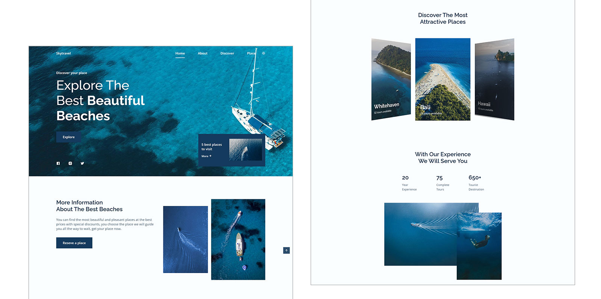
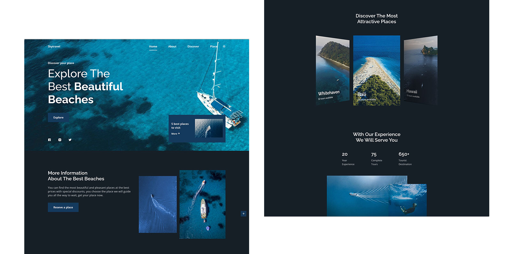

# Skytravel

Projeto criado para uma empresa de viagens utilizando HTML, CSS, JavaScript. Teve como objetivo exercitar os conhecimentos.

 

## Light Mode Preview

 

## Dark Mode Preview

 

## Live Preview:
https://robsonvinicius.github.io/skytravel/

 

### 📁 Assets

Assets | Description | Site
------------ | ------------- | ------------ 
Google Fonts | Font Types by Google | https://fonts.google.com/
Remix Icon | Simply Delightful Icon System |  https://remixicon.com/
Swiper | The Most Modern Mobile Touch Slider | https://swiperjs.com/
ScrollReveal | Animate elements as they scroll into view. | https://scrollrevealjs.org/

 

### ⚙️ Other Utilities

Utilities | Description | Site
------------ | ------------- | ----------
HSL color mode | W3 Scools Colors | https://www.w3schools.com/colors/colors_hsl.asp

 

### 📷 Images

Source | Site
------------ | -------------
Pexels | https://www.pexels.com/
Unsplash | https://unsplash.com/
